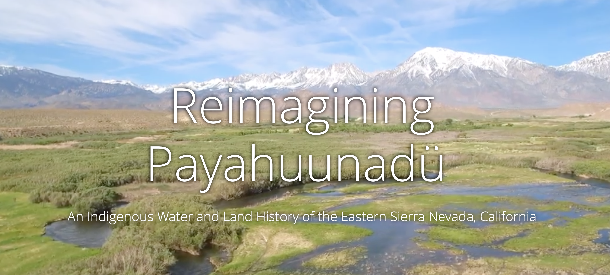
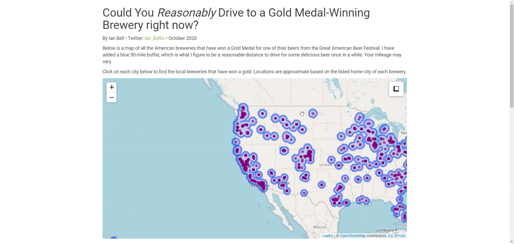
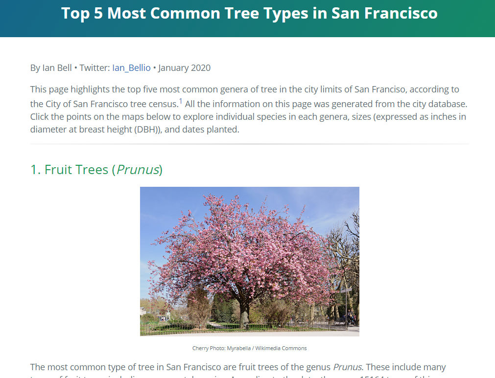

```{r setup, include=FALSE}
knitr::opts_chunk$set(echo = TRUE)
```


### Reimagining Payahuunadü

[Reimagining Payahuunadü](http://www.oviwc.org/storymap/) is an ESRI Story Map I made the uses maps and visuals to tell the Indigenous Water and Land History of the Eastern Sierra Nevada in California. 




### Gold Medal Beers
[Gold Medal Beers](https://iandouglasbell.github.io/Beer.html) is an RMarkdown webpage I made for a Tidy Tuesday data challenge. It uses leaflet mapping and the DT package to create a interactive table of results. 



### San Francisco Trees
[San Francisco Trees](https://iandouglasbell.github.io/SFtrees.html) is an RMarkdown webpage I made for a Tidy Tuesday data challenge. It uses leaflet mapping to explore the tree census of San Francisco.  

