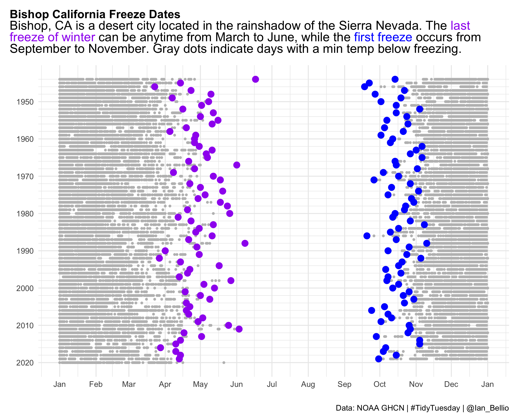
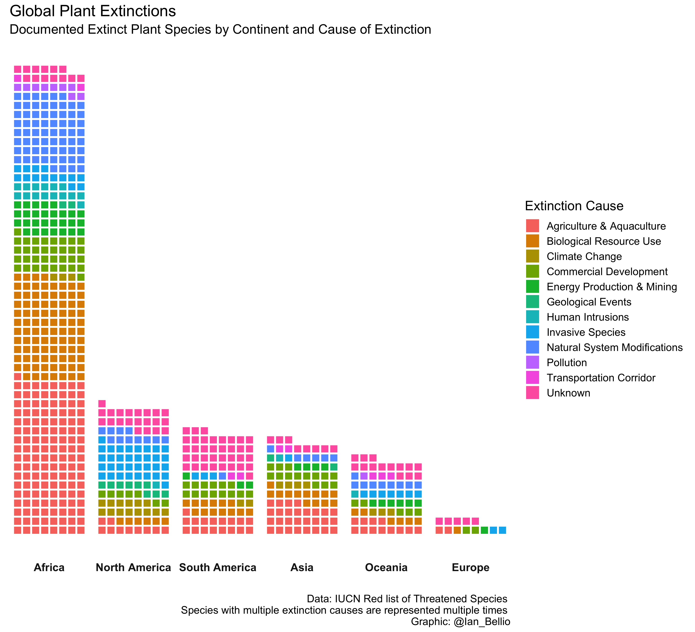
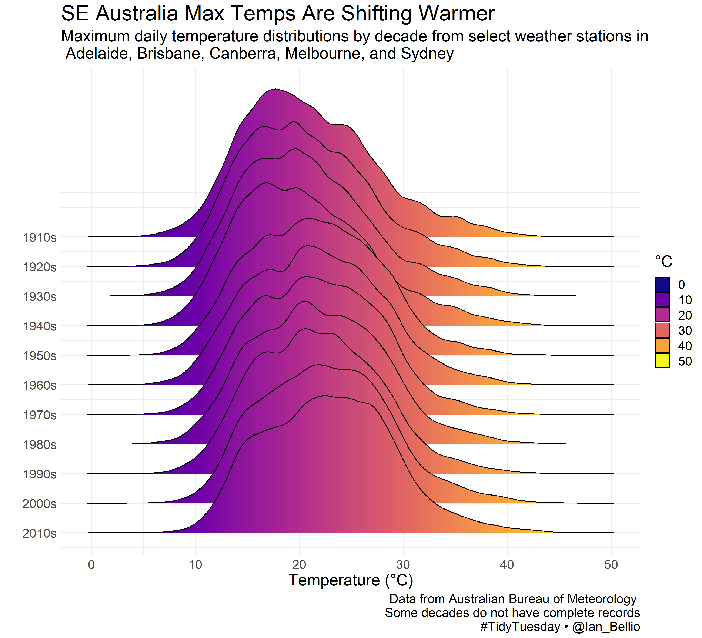
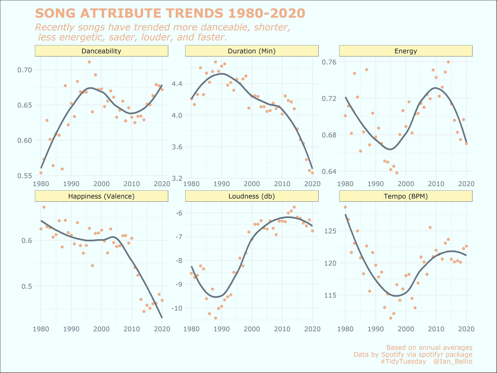
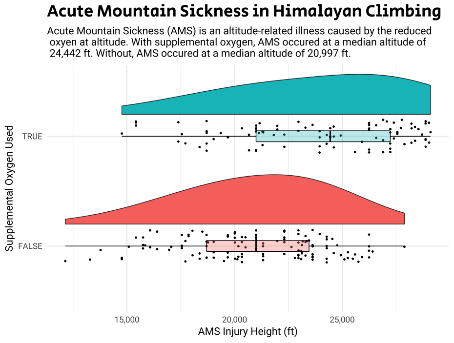
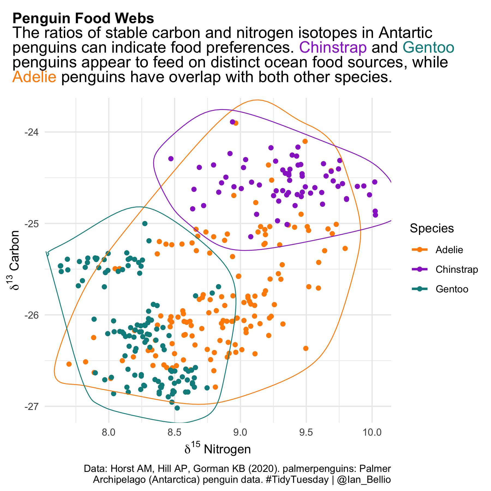
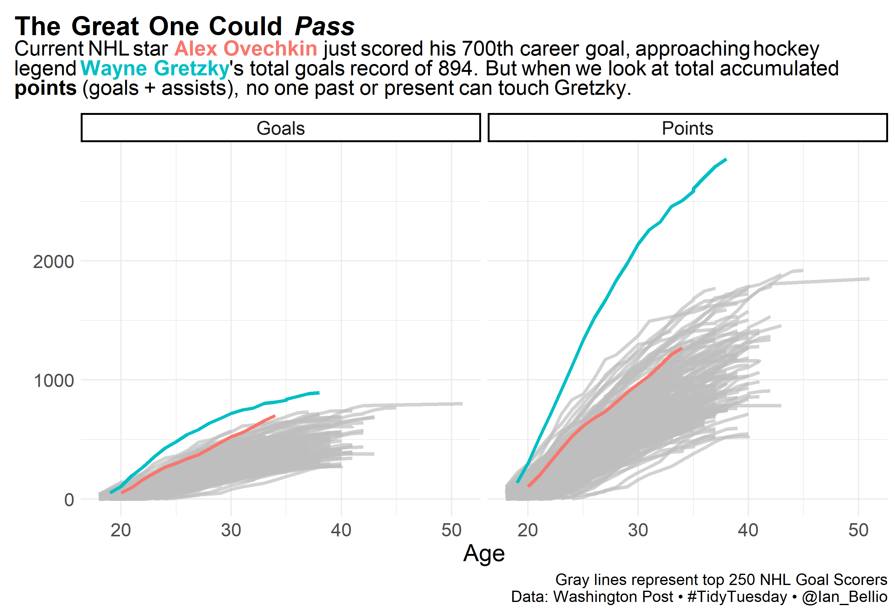
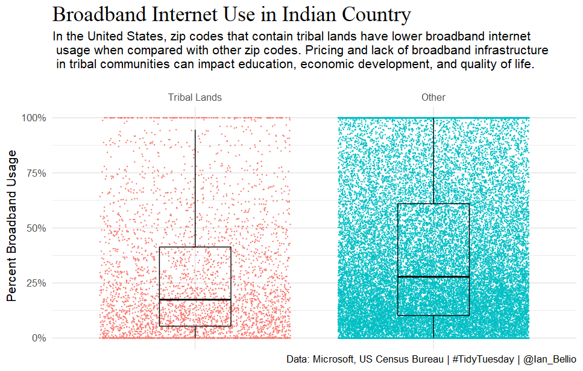
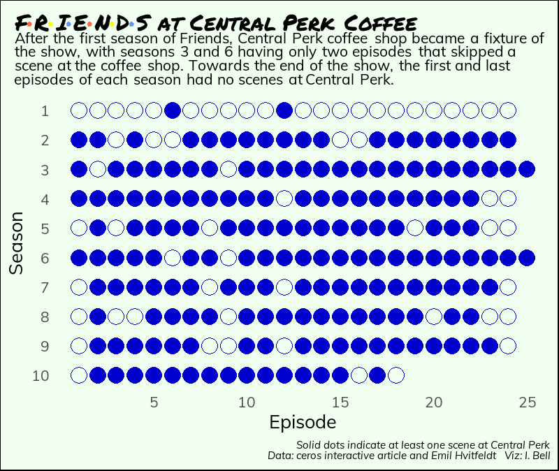

```{r setup, include=FALSE}
knitr::opts_chunk$set(echo = TRUE)
```

I use the [Tidy Tuesdays](https://github.com/rfordatascience/tidytuesday) project as a way of improving my R coding and data analysis skills at lunch or after work. Here are a few of my favorite data visualizations. All my Tidy Tuesday contributions can be found at my [Tidy Tuesdays](https://github.com/iandouglasbell/Tidy-Tuesdays) Repo.

##### [Bishop Freezes (click to view code)](https://github.com/iandouglasbell/Tidy-Tuesdays/blob/master/2020-10-27)


##### [Global Plant Extinctions](https://github.com/iandouglasbell/Tidy-Tuesdays/tree/master/2020-08-18)



##### [Austrailian Temps](https://github.com/iandouglasbell/Tidy-Tuesdays/tree/master/2020-01-07)



##### [Song Trends](https://github.com/iandouglasbell/Tidy-Tuesdays/tree/master/2020-01-21)



##### [Climbing AMS](https://github.com/iandouglasbell/Tidy-Tuesdays/tree/master/2020-09-29)



##### [Penguin Food Webs](https://github.com/iandouglasbell/Tidy-Tuesdays/tree/master/2020-07-27)




##### [Hockey](https://github.com/iandouglasbell/Tidy-Tuesdays/tree/master/2020-03-03)



##### [Broadband in Indian Country](https://github.com/iandouglasbell/Tidy-Tuesdays/tree/master/2021-05-12)



##### [Friends](https://github.com/iandouglasbell/Tidy-Tuesdays/tree/master/2020-09-08)


